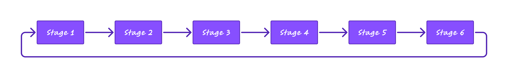

<a id="readme-top"></a>

# ⚠️Under construction

---

<!-- PROJECT SHIELDS -->
<!--
*** I'm using markdown "reference style" links for readability.
*** Reference links are enclosed in brackets [ ] instead of parentheses ( ).
*** See the bottom of this document for the declaration of the reference variables
*** for contributors-url, forks-url, etc. This is an optional, concise syntax you may use.
*** https://www.markdownguide.org/basic-syntax/#reference-style-links
-->

<div align="center">

  Inference Notebook: <a href="https://colab.research.google.com/drive/1sIfSMRB8TYX0G5YbdmtM89Sog-5ZplbA#scrollTo=BtfW45wkVCHz" target="_blank"></a> 
    
  [![Contributors][contributors-shield]][contributors-url]
  [![Forks][forks-shield]][forks-url]
  [![Stargazers][stars-shield]][stars-url]
  [![Issues][issues-shield]][issues-url]
  [![Unlicense License][license-shield]][license-url]

</div>

<!-- PROJECT LOGO -->
<br />
<div align="center">
  <a href="https://github.com/Mohammadimh76/image-caption-generator-pytorch">
    
  </a>

  <h3 align="center">Image Caption Generation using Deep Learning (CNN + LSTM Architecture)</h3>

  <p align="center">
    <br />
    <a href="https://github.com/Mohammadimh76/image-caption-generator-pytorch" target="_blank">View Demo</a>
    &middot;
    <a href="https://github.com/Mohammadimh76/image-caption-generator-pytorch/issues/new?labels=bug&template=bug-report---.md" target="_blank">Report Bug</a>
    &middot;
    <a href="https://github.com/Mohammadimh76/image-caption-generator-pytorch/issues/new?labels=enhancement&template=feature-request---.md" target="_blank">Request Feature</a>
  </p>
</div>

---

## 🧑‍🏫 Mentor 

|  <b>⚜️</b>  | <b>Mehdi Kazemi</b>  | [![Github][Github.com]][github-mentor-url] [![Linkedin][Linkedin.com]][linkedin-mentor-url]  |
| ------------- | ------------- | ------------- |


---

<!-- TABLE OF CONTENTS -->
  ## 📖 Table of Contents 
  <ol>
    <li>
      <a href="#about-the-project">About The Project</a>
          <ul>
            <li><a href="#approach-the-encoder-decoder-framework">Approach: The Encoder-Decoder Framework</a></li>
            <li><a href="#project-phases">Project Phases</a></li>
            <li><a href="#common-datasets-for-image-captioning">Common Datasets for Image Captioning</a></li>
            <li><a href="#evaluation-metrics-for-image-captioning">Evaluation Metrics for Image Captioning</a></li>
            <li><a href="#conclusion">Conclusion</a></li>
            <li><a href="#step-2-review-existing-methods">Step 2: Review existing methods</a></li>
            <li><a href="#step-3-choose-the-best-method">Step 3: Choose the best method</a></li>
            <li><a href="#step-4-implement-the-chosen-method">Step 4: Implement the chosen method</a></li>
          </ul>
      <ul>
        <li><a href="#about-the-dataset">About the Dataset</a></li>
        <li><a href="#built-with">Built With</a></li>
      </ul>
    </li>
    <li>
      <a href="#getting-started">Getting Started</a>
      <ul>
        <li><a href="#prerequisites">Prerequisites</a></li>
        <li><a href="#installation">Installation</a></li>
      </ul>
    </li>
    <li><a href="#usage">Usage</a></li>
    <li><a href="#roadmap">Roadmap</a></li>
    <li><a href="#contributing">Contributing</a></li>
    <li><a href="#license">License</a></li>
    <li><a href="#contact">Contact</a></li>
    <li><a href="#acknowledgments">Acknowledgments</a></li>
    <li><a href="#references">References</a></li>
    <li><a href="#faqs">FAQs</a></li>
  </ol>
  
---

<!-- ABOUT THE PROJECT -->
## 📌About The Project

This project aims to develop an AI-powered system capable of generating descriptive text for images. Given an image as input, the system will analyze its content and produce a meaningful and contextually relevant textual description as output.

The task, known as image captioning, is a complex challenge that lies at the intersection of computer vision and natural language processing (NLP). The system must not only recognize objects, actions, and scenes within an image but also structure this information into a fluent, human-like description.

### Approach: The Encoder-Decoder Framework
Most image captioning systems follow an encoder-decoder framework. In this approach, an image is first processed by an encoder, which converts it into a feature vector representing its key visual elements. Then, a decoder takes this feature vector and generates a sequence of words, forming a meaningful textual description of the image.

### Project Phases
<b>Phase 1 – Backend Development</b>
  - Define the problem and research existing approaches.
  - Select the most effective method for image captioning.
  - Implement and optimize the chosen model.
  - Conduct rigorous testing and refine the system.
  - Deploy the backend solution and document findings.

<b>Phase 2 – Frontend Development</b>
  - Design and develop user-friendly application windows.
  - Ensure a seamless user experience for interacting with the model.

<b>Phase 3 – Wizard Setup & Executable File</b>
  - Develop an installation wizard to simplify deployment.
  - Create an executable file for easy system usage.

<b>Phase 4 – Usability & Software Testing</b>
- Conduct extensive usability testing to improve user experience.
- Perform software testing to ensure stability, accuracy, and performance.

### Common Datasets for Image Captioning
Several benchmark datasets are widely used for training and evaluating image captioning models. These datasets contain large collections of images paired with human-annotated textual descriptions. Some of the most commonly used datasets include:

- <b>[COCO (Common Objects in Context)](https://cocodataset.org/#home)</b> – One of the most popular datasets for image captioning, COCO contains over 120,000 images, each annotated with multiple human-written captions. It provides a diverse range of everyday scenes and objects, making it ideal for training robust models.

- <b>[Flickr8k](https://www.kaggle.com/datasets/adityajn105/flickr8k) & [Flickr30k](https://paperswithcode.com/dataset/flickr30k)</b> – These datasets consist of 8,000 and 30,000 images, respectively, collected from Flickr. Each image is accompanied by five descriptive captions, providing rich textual annotations for training captioning models.

- <b>[nocaps (Novel Object Captioning at Scale)](https://nocaps.org/)</b> – A challenging dataset designed to evaluate a model's ability to describe images containing objects that were not seen during training. It tests generalization beyond the training data and is valuable for improving real-world performance.

These datasets play a crucial role in developing and benchmarking image captioning models, ensuring that they can generate accurate and diverse textual descriptions for a wide range of images.

### Evaluation Metrics for Image Captioning
To assess the quality of generated image captions, several automatic evaluation metrics are commonly used. These metrics compare the generated captions with human-annotated reference captions and measure how well they match in terms of content, structure, and fluency. Two widely used metrics are:

- <b>BLEU (Bilingual Evaluation Understudy)</b> – This metric evaluates the similarity between generated and reference captions by measuring the n-gram overlap (i.e., how many words or phrases match between the generated text and human-written descriptions). BLEU is commonly used in machine translation and image captioning, but it may not always capture semantic meaning effectively.

- <b>CIDEr (Consensus-based Image Description Evaluation)</b> – Unlike BLEU, CIDEr is specifically designed for image captioning. It computes the <b>TF-IDF (Term Frequency-Inverse Document Frequency) weighted n-gram similarity</b> between generated and reference captions, emphasizing important and distinctive words. CIDEr generally correlates better with human judgment in image captioning tasks.

Both metrics help evaluate how well an AI-generated caption aligns with human expectations, but they are often complemented by human evaluation to ensure captions are not just textually similar but also meaningful and contextually accurate.

### Conclusion
This project has numerous practical applications, including assistive technologies for visually impaired individuals, automated image annotation, and content management systems. By bridging the gap between vision and language, we aim to create a powerful tool that enhances accessibility, improves content organization, and contributes to advancements in AI-driven language generation.

### Step 2: Review existing methods
To achieve high-quality image captioning, different deep learning architectures can be employed. The project explores three main approaches, each improving upon the previous one:

1. <b>Method 1 (CNN + LSTM Architecture):</b> A traditional encoder-decoder framework where:
    - A <b>Convolutional Neural Network (CNN)</b> extracts visual features from the image.
    - A <b>Long Short-Term Memory (LSTM)</b> network serves as the decoder, generating a sequence of words based on the extracted features.
    - This approach captures sequential dependencies in text but may struggle with long-range dependencies and context retention.
[^1] [^2]

2. <b>Method 2 (Enhanced CNN + LSTM with Attention Mechanism):</b> To improve upon the basic CNN-LSTM model, an attention mechanism is integrated:
    - Instead of relying solely on a single fixed feature vector, <b>attention</b> dynamically focuses on different image regions while generating each word.
    - This allows the model to prioritize important visual features at each step, improving caption relevance and coherence.
    - The <b>Soft Attention</b> and <b>Hard Attention</b> mechanisms can be explored to enhance interpretability.
[^3] [^4]

3. <b>Method 3 (Transformer-based Model):</b> Leveraging <b>Transformers</b>, which have revolutionized both NLP and vision tasks:
    - <b>Vision Transformer (ViT)</b> or <b>CNN-based feature extractors</b> encode the image.
    - A <b>Transformer-based decoder</b> generates text using a self-attention mechanism, efficiently capturing long-range dependencies.
    - This model significantly improves fluency, contextual understanding, and adaptability to diverse images.
[^5] [^6] [^7] [^8]

Each of these approaches builds upon the strengths of the previous one, moving from traditional sequence models toward state-of-the-art architectures for more accurate, human-like image descriptions.


### Step 3: Choose the best method

<!-- Step(3)Choose the best method-train-1.png -->
<br />
<div align="center">
    
  <em>Step(3)Choose the best method-train-1</em>
</div>

<!-- Step(3)Choose the best method-train-2.png -->
<div align="center">
    
  <em>Step(3)Choose the best method-train-2</em>
</div>

### Step 4: Implement the chosen method
The development of the image captioning system follows a structured, step-by-step approach to ensure efficiency and accuracy. The key stages of the implementation are:


<!-- Stages.png -->
<div align="center">
    
</div>


<b>Stage 1: Data Preparation</b>
  - Collect and preprocess image-caption datasets (e.g., COCO, Flickr30k, nocaps).
  - Perform image resizing, normalization, and tokenization of text captions.
  - Split the dataset into training, validation, and test sets.


<b>Stage 2: Model Selection & Design</b>
  - Choose an appropriate architecture: <b>CNN + LSTM, Attention-based CNN-LSTM, or Transformer-based model.</b>
  - Implement the encoder (CNN/ViT) for feature extraction.
  - Implement the decoder (LSTM/Transformer) for text generation.

<b>Stage 3: Model Configuration</b>
  - Define hyperparameters such as <b>learning rate, batch size, embedding size, and dropout rate.</b>
  - Select an optimizer (<b>Adam, RMSprop</b>) and loss function (<b>cross-entropy, BLEU-based loss</b>).
  - Configure pre-trained embeddings if applicable.

<b>Stage 4: Training & Evaluation Functions</b>
  - Implement <b>loss functions</b> and <b>evaluation metrics (BLEU, CIDEr, METEOR).</b>
  Define the training loop, incorporating <b>gradient updates, backpropagation, and - attention mechanisms</b> if used.
  - Implement a checkpointing system to save and restore the best models.

<b>Stage 5: Model Training</b>
  - Train the model using <b>GPU-accelerated deep learning frameworks</b> (<b>TensorFlow/PyTorch</b>).
  - Fine-tune the model on validation data to prevent overfitting.
  - Utilize techniques like <b>learning rate scheduling and early stopping</b> for optimization.

<b>Stage 6: Model Evaluation & Testing</b>
  - Evaluate the trained model on the test dataset using automated metrics.
  - Compare performance across different architectures (CNN-LSTM, Attention-based, Transformer).
  - Perform qualitative analysis by visually inspecting generated captions.

Following these stages ensures a structured workflow, leading to a well-optimized model capable of generating accurate and contextually relevant image descriptions.


<p align="right">(<a href="#readme-top">back to top</a>)</p>


### 📊About the Dataset 

## Selected Dataset: Flickr8k

The Flickr8k dataset is a benchmark collection designed for sentence-based image description and image search tasks. It consists of 8,000 images, each paired with five distinct human-annotated captions that provide clear and detailed descriptions of the key entities and events within the scene.


<b>Dataset Characteristics</b><br>
  - Diverse Content – Images were manually selected from six different Flickr groups, ensuring a wide range of everyday scenes, objects, and activities.
  - No Famous Landmarks or Celebrities – The dataset avoids well-known people and locations, focusing instead on generic yet meaningful real-world scenarios.
  - Rich Annotations – Each image has five independent captions, capturing different perspectives and variations in language usage.

<b>Data Collection & Timeframe</b><br>
The images were sourced from Flickr and manually curated to ensure visual diversity and descriptive richness. While the exact time period of collection is not specified, the dataset remains a widely used standard in computer vision and natural language processing research.

<b>Why Flickr8k?</b><br>
✅ Compact yet effective – Suitable for training image captioning models with limited computational resources.<br>
✅ Multiple captions per image – Provides linguistic diversity, helping models learn contextual variations.<br>
✅ Standard benchmark – Frequently used in research for comparison with existing approaches in image captioning and retrieval.

Before training, the dataset undergoes preprocessing, including image resizing, normalization, and text tokenization, to optimize performance for deep learning models.

<b>Source:</b> [Flickr8k](https://www.kaggle.com/datasets/adityajn105/flickr8k)

### 🛠Built With 

---

<!-- GETTING STARTED -->
## 🚀Getting Started

Follow these simple steps to get a local copy of the project up and running:

### ✅Prerequisites 

This is an example of how to list things you need to use the software and how to install them.

### 🖥Installation 

Follow these simple steps to install and set up your app. This template is fully self-contained and does not require any external dependencies or services.

1. Clone the repository
   ```sh
   git clone https://github.com/Mohammadimh76/image-caption-generator-pytorch
   

<p align="right">(<a href="#readme-top">back to top</a>)</p>


---

<!-- USAGE EXAMPLES -->
## 🎯Usage 

<p align="right">(<a href="#readme-top">back to top</a>)</p>


---

<!-- ROADMAP -->
## 🗺Roadmap 
- [ ] Phase (1) - Backend Development
  - [x] Step 1: Define the problem
  - [x] Step 2: Review existing methods
  - [x] Step 3: Choose the best method
  - [x] Step 4: Implement the chosen method
  - [ ] Step 5: Test the solution
  - [ ] Step 6: Improve the method
  - [ ] Step 7: Apply the solution in practice
  - [ ] Step 8: Document and present the work
- [x] Phase (2) - Frontend Development
  - [x] Design and implement application windows
- [ ] Phase (3) – Wizard Setup + Executable File
- [ ] Phase (4) – Usability & Software Testing


See the [open issues][open-issues-url] for a full list of proposed features (and known issues).

<p align="right">(<a href="#readme-top">back to top</a>)</p>


---

<!-- CONTRIBUTING -->
## 🤝Contributing 

The open-source community thrives on collaboration, learning, and innovation. Your contributions—big or small—help make this project better for everyone, and we truly appreciate them!

If you have a suggestion for improvement, feel free to fork the repository and submit a pull request. Alternatively, you can open an issue with the "enhancement" tag. And don’t forget to ⭐ star the project—your support means a lot!

<b>How to Contribute:</b>
1. Fork the repository
2. Create a feature branch (`git checkout -b feature/AmazingFeature`)
3. Commit your changes (`git commit -m 'Add some AmazingFeature'`)
4. Push to your branch (`git push origin feature/AmazingFeature`)
5. Open a pull request

Thank you for helping improve this project! 🚀💡

<p align="right">(<a href="#readme-top">back to top</a>)</p>

---

<!-- LICENSE -->
## 📜License 

Distributed under the Unlicense License. See `LICENSE.txt` for more information.

<p align="right">(<a href="#readme-top">back to top</a>)</p>

---

<!-- CONTACT -->
## 📞Contact 

|  <b>[1]</b>  | <b>Mohammad Hossein Mohammadi</b>  | [![Github][Github.com]][github-url] [![Linkedin][Linkedin.com]][linkedin-url] |
| ------------- | ------------- | ------------- |
| <b>[2]</b> | <b>Project Link</b>  | [![ProjectLink][ProjectLink.com]][projectLink-url] |


<p align="right">(<a href="#readme-top">back to top</a>)</p>

---

<!-- ACKNOWLEDGMENTS -->
## 🙌Acknowledgments 
 
<p align="right">(<a href="#readme-top">back to top</a>)</p>


---

<!-- REFERENCES -->
## 🔗References 

[^1]: How to Build an Image-Captioning Model in Pytorch - <b>([Link](https://towardsdatascience.com/how-to-build-an-image-captioning-model-in-pytorch-29b9d8fe2f8c/))</b>
[^2]: Pytorch Image Captioning Tutorial (Youtube) - <b>([Link](https://www.youtube.com/watch?v=y2BaTt1fxJU))</b>
[^3]: Show, Attend and Tell: Neural Image Caption Generation with Visual Attention - <b>([Link](https://arxiv.org/abs/1502.03044))</b>
[^4]: a-PyTorch-Tutorial-to-Image-Captioning - (Github) - <b>([Link](https://github.com/sgrvinod/a-PyTorch-Tutorial-to-Image-Captioning))</b>
[^5]: CPTR: Full Transformer Network for Image Captioning - <b>([Link](https://arxiv.org/abs/2101.10804))</b>
[^6]: transformer-image-captioning - (Github) - <b>([Link](https://github.com/milkymap/transformer-image-captioning))</b>
[^7]: Vision Transformers (ViT) in Image Captioning Using Pretrained ViT Models - <b>([Link](https://www.analyticsvidhya.com/blog/2023/06/vision-transformers/))</b>
[^8]: catr - (Github) - <b>([Link](https://github.com/saahiluppal/catr))</b>

### Datasets
1. [COCO (Common Objects in Context)](https://cocodataset.org/#home)
2. [Flickr8k](https://www.kaggle.com/datasets/adityajn105/flickr8k)
3. [Flickr30k](https://paperswithcode.com/dataset/flickr30k)
4. [nocaps (Novel Object Captioning at Scale)](https://nocaps.org/)

<p align="right">(<a href="#readme-top">back to top</a>)</p>
   
---

<!-- FAQs -->
## ❓FAQs 


<p align="right">(<a href="#readme-top">back to top</a>)</p>


<!-- MARKDOWN LINKS & IMAGES -->
<!-- https://www.markdownguide.org/basic-syntax/#reference-style-links -->

[contributors-shield]: https://img.shields.io/github/contributors/mohammadimh76/image-caption-generator-pytorch.svg?style=for-the-badge
[contributors-url]: https://github.com/mohammadimh76/image-caption-generator-pytorch/graphs/contributors

[forks-shield]: https://img.shields.io/github/forks/mohammadimh76/image-caption-generator-pytorch.svg?style=for-the-badge
[forks-url]: https://github.com/Mohammadimh76/image-caption-generator-pytorch/network/members

[stars-shield]: https://img.shields.io/github/stars/Mohammadimh76/image-caption-generator-pytorch.svg?style=for-the-badge
[stars-url]: https://github.com/Mohammadimh76/image-caption-generator-pytorch/stargazers

[issues-shield]: https://img.shields.io/github/issues/Mohammadimh76/image-caption-generator-pytorch.svg?style=for-the-badge
[issues-url]: https://github.com/Mohammadimh76/image-caption-generator-pytorch/issues

[license-shield]: https://img.shields.io/github/license/Mohammadimh76/image-caption-generator-pytorch.svg?style=for-the-badge
[license-url]: https://github.com/Mohammadimh76/image-caption-generator-pytorch/blob/master/LICENSE.txt

[linkedin-url]: https://www.linkedin.com/in/mohammadimh76/
[linkedin-mentor-url]: https://www.linkedin.com/in/mehdikazemi8/
[Linkedin.com]: https://img.shields.io/badge/LinkedIn-0077B5?style=for-the-badge&logo=linkedin&logoColor=white

[github-url]: https://github.com/Mohammadimh76
[github-mentor-url]: https://github.com/mehdikazemi8
[Github.com]: https://img.shields.io/badge/GitHub-181717?style=for-the-badge&logo=github&logoColor=white

[projectLink-url]: https://github.com/Mohammadimh76/image-caption-generator-pytorch
[ProjectLink.com]: https://img.shields.io/badge/Project-Link-blue?style=for-the-badge

[gmail-url]: m.h.mohammadimir2017@gmail.com
[Gmail.com]: https://img.shields.io/badge/Gmail-D14836?style=for-the-badge&logo=gmail&logoColor=white

[open-issues-url]: https://github.com/Mohammadimh76/image-caption-generator-pytorch/issues

[inference-notebook-url]: https://colab.research.google.com/drive/1sIfSMRB8TYX0G5YbdmtM89Sog-5ZplbA#scrollTo=BtfW45wkVCHz
